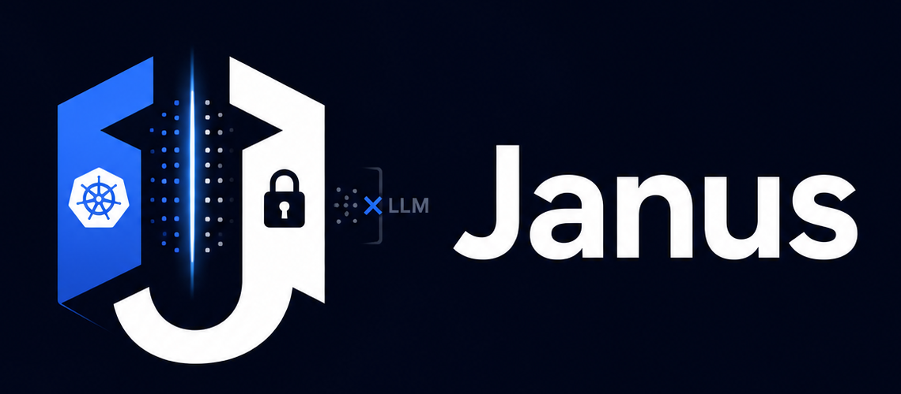

<p align="center">
  
</p>

<p align="center">
  <i>Two faces. One cluster. No exposed keys.</i>
</p>

---

## What is Janus?

Janus is an [MCP (Model Context Protocol)](https://modelcontextprotocol.io) server that gives AI assistants a safe, controlled window into your Kubernetes clusters. It runs locally, holds your `KUBECONFIG` close to its chest, and lets the LLM operate through carefully‑scoped tools — so you get the power of an AI copilot without ever shipping a token, certificate, or API server URL to a third‑party model.

Named after the Roman god of gateways (who famously looks both ways at once), Janus faces the LLM with clean, declarative tool definitions, and faces your cluster with full administrative access — while ensuring the two never meet inappropriately.

## The problem

LLMs are incredibly useful for debugging, operating, and reasoning about Kubernetes. But the moment you paste a `KUBECONFIG` into a chat window or send it to an external API, you’ve handed over the keys to your kingdom. For most organisations, that’s a non‑starter.

Self‑hosting a model helps, but not everyone can or wants to run frontier‑grade LLMs locally. Janus gives you a third path: keep the credentials on‑prem (or on your laptop) and let the remote model work with sanitised, high‑level cluster information only.

## How it works
```
┌──────────────┐       ┌────────────────┐       ┌───────────────┐
│ LLM Client   │<─────>│ Janus (local)  │<─────>│ Kubernetes    │
│ (Claude,     │   MCP │ holds the      │   k8s │ API Server    │
│ VS Code,     │       │ KUBECONFIG     │   API │               │
│ custom)      │       │ redacts output │       │               │
└──────────────┘       └────────────────┘       └───────────────┘
```
1. **Tools, not text dumps** — Janus exposes a set of MCP tools (`get_pods`, `describe_deployment`, `get_events`, etc.) that the LLM can call. It never hands over raw cluster state.
2. **Automatic redaction** — Every response from the Kubernetes API is sanitised. Secrets, tokens, env‑var values, and sensitive metadata are stripped before the LLM ever sees them.
3. **Human approval for writes** — Read‑only operations are instant. Destructive actions (restart, scale, delete) require an explicit confirmation step inside your MCP client. The LLM can *propose* the action, but a human has to pull the trigger.
4. **Scoped access** — Janus can be locked to a specific namespace, set of clusters, or even a subset of resources, adding an extra safety net beyond whatever your `KUBECONFIG` permits.

## Features

- 🔒 **Zero‑credential exposure** — your `KUBECONFIG` never leaves the process running Janus.
- 🔍 **Rich read‑only diagnostics** — pods, events, logs, deployments, cluster summaries.
- ✍️ **Guarded write operations** — rollout restart, scale, and more, with a human‑in‑the‑loop.
- 🧹 **Pluggable redaction engine** — sensible defaults, easily extended to your own patterns.
- 🧭 **Cluster overview, two ways** — the `get_cluster_summary` tool, plus a pinnable `cluster://summary` MCP resource that gives the LLM context without a flurry of tool calls.
- 🧪 **Works with any MCP client** — Claude Code, Claude Desktop, VS Code, Codex, or your own agent loop.

## Roadmap

- PyPI / Homebrew / container distribution
- Streamable HTTP sidecar mode (bearer token + Origin validation)
- `diagnose_namespace` prompt template

## Quick start

```bash
# from a checkout (PyPI release pending)
git clone https://github.com/tonylchang/janus-mcp && cd janus-mcp
uv sync
cp examples/config.yaml ~/.config/janus-mcp/config.yaml
$EDITOR ~/.config/janus-mcp/config.yaml   # set your kubeconfig context + namespaces

# register with Claude Code:
claude mcp add kubernetes -- uv --directory "$PWD" run janus-mcp serve
```

Registration recipes for Claude Desktop, VS Code/Copilot, Codex CLI, and Cursor
are in the **[quick start guide](docs/quickstart.md)**.

Now ask your AI assistant something like:
*“Why are pods crashing in the prod namespace?”*

Janus will fetch the relevant information, sanitise it, and the LLM will walk you through what’s happening — safely.

## Docs

- [Operator runbook](docs/runbook.md) — install, least-privilege RBAC, approvals, audit log, troubleshooting
- [Threat model](docs/threat-model.md) — the five security invariants and how CI verifies them
- [`rbac/`](rbac/janus-mcp-rbac.yaml) — least-privilege manifests (note what is absent: secrets — nowhere, ever)

Janus is currently in active development.
